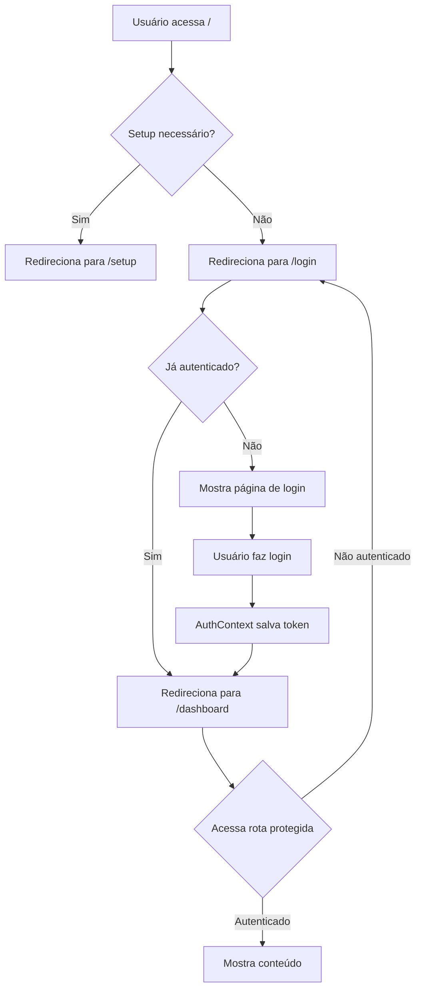

# 📁 Estrutura de Rotas - Movix Frontend

Esta documentação descreve a organização das rotas do projeto Movix usando **Route Groups** do Next.js 14.

## 🗂️ Estrutura de Pastas

```
app/
├── (auth)/                 # 🔓 Grupo de rotas públicas (autenticação)
│   ├── layout.tsx          # Layout com PublicRoute
│   ├── login/
│   ├── register/
│   ├── forgot-password/
│   ├── reset-password/
│   ├── setup/
│   ├── terms/
│   └── privacy/
│
├── (dashboard)/            # 🔐 Grupo de rotas protegidas
│   ├── layout.tsx          # Layout com ProtectedRoute + Sidebar
│   ├── dashboard/
│   └── cadastros/
│       ├── clientes/
│       ├── fornecedores/
│       └── produtos/
│
├── layout.tsx              # Root layout (ThemeProvider, AuthProvider, Toaster)
├── page.tsx                # Homepage (redireciona para /setup ou /login)
└── globals.css             # Estilos globais
```

---

## 🎯 **Route Groups** - O que são?

Route Groups são uma feature do Next.js 14 que permite **organizar rotas sem afetar a URL**.

### Características:

- **Pastas entre parênteses** `(nome)` não aparecem na URL
- Cada grupo pode ter seu próprio `layout.tsx`
- Perfeito para separar rotas públicas e protegidas

### Exemplo:

```
app/(auth)/login/page.tsx     → URL: /login
app/(dashboard)/dashboard/page.tsx → URL: /dashboard
```

Os `(auth)` e `(dashboard)` **não aparecem** na URL! 🎉

---

## 📦 Detalhamento dos Grupos

### 🔓 `(auth)` - Rotas Públicas

**Propósito:** Páginas de autenticação e informações públicas

**Layout:** `app/(auth)/layout.tsx`
- Usa `<PublicRoute>` para redirecionar usuários autenticados
- Sem sidebar ou header
- Layout simples e limpo

**Rotas:**
- `/login` - Login
- `/register` - Registro
- `/forgot-password` - Recuperação de senha
- `/reset-password/[token]` - Reset de senha
- `/setup` - Configuração inicial (super admin)
- `/terms` - Termos de serviço
- `/privacy` - Política de privacidade

**Comportamento:**
- ✅ Acessível sem autenticação
- ✅ Redireciona para `/dashboard` se já autenticado
- ✅ Layout minimalista

---

### 🔐 `(dashboard)` - Rotas Protegidas

**Propósito:** Páginas que requerem autenticação

**Layout:** `app/(dashboard)/layout.tsx`
- Usa `<ProtectedRoute>` para verificar autenticação
- Inclui `<AppSidebar>` e `<SiteHeader>`
- Layout completo da aplicação

**Rotas:**
- `/dashboard` - Dashboard principal
- `/cadastros` - Página de cadastros
- `/cadastros/clientes` - Gestão de clientes
- `/cadastros/fornecedores` - Gestão de fornecedores
- `/cadastros/produtos` - Gestão de produtos

**Comportamento:**
- ✅ Requer autenticação
- ✅ Redireciona para `/login` se não autenticado
- ✅ Sidebar e header sempre visíveis
- ✅ Verificação de permissões (futuro)

---

## 🔄 Fluxo de Autenticação



---

## 🛡️ Proteção de Rotas

### Componentes de Proteção

#### `<PublicRoute>`
Usado no layout `(auth)`:
```tsx
// app/(auth)/layout.tsx
export default function AuthLayout({ children }) {
  return <PublicRoute>{children}</PublicRoute>;
}
```

**Comportamento:**
- Permite acesso sem autenticação
- Redireciona para `/dashboard` se já autenticado
- Mostra loading durante verificação

#### `<ProtectedRoute>`
Usado no layout `(dashboard)`:
```tsx
// app/(dashboard)/layout.tsx
export default function DashboardLayout({ children }) {
  return (
    <ProtectedRoute>
      <SidebarProvider>
        <AppSidebar />
        <SidebarInset>
          <SiteHeader />
          {children}
        </SidebarInset>
      </SidebarProvider>
    </ProtectedRoute>
  );
}
```

**Comportamento:**
- Requer autenticação
- Redireciona para `/login` se não autenticado
- Verifica permissões (opcional)
- Mostra loading durante verificação

---

## 📝 Layouts Hierárquicos

O Next.js 14 usa layouts hierárquicos. Cada layout envolve seus filhos:

```
Root Layout (app/layout.tsx)
  ├─ ThemeProvider
  ├─ AuthProvider
  └─ Toaster
      │
      ├─ Auth Layout (app/(auth)/layout.tsx)
      │   └─ PublicRoute
      │       └─ Login Page
      │
      └─ Dashboard Layout (app/(dashboard)/layout.tsx)
          └─ ProtectedRoute
              └─ SidebarProvider
                  ├─ AppSidebar
                  └─ SidebarInset
                      ├─ SiteHeader
                      └─ Dashboard Page
```

---

## 🎨 Vantagens desta Estrutura

### ✅ **Organização Clara**
- Rotas públicas e protegidas separadas
- Fácil de entender e manter

### ✅ **Reutilização de Código**
- Layouts compartilhados
- Sem duplicação de sidebar/header

### ✅ **Performance**
- Layouts são renderizados uma vez
- Apenas o conteúdo da página muda

### ✅ **Segurança**
- Proteção centralizada no layout
- Impossível esquecer de proteger uma rota

### ✅ **DX (Developer Experience)**
- Adicionar nova rota protegida: apenas criar arquivo em `(dashboard)/`
- Adicionar nova rota pública: apenas criar arquivo em `(auth)/`
- Sem necessidade de adicionar `<ProtectedRoute>` em cada página

---

## 🚀 Como Adicionar Novas Rotas

### Rota Pública (sem autenticação)

1. Criar arquivo em `app/(auth)/minha-rota/page.tsx`
2. Pronto! Já está protegida pelo layout

```tsx
// app/(auth)/minha-rota/page.tsx
export default function MinhaRota() {
  return <div>Conteúdo público</div>;
}
```

### Rota Protegida (com autenticação)

1. Criar arquivo em `app/(dashboard)/minha-rota/page.tsx`
2. Pronto! Já tem sidebar, header e proteção

```tsx
// app/(dashboard)/minha-rota/page.tsx
export default function MinhaRota() {
  return (
    <div className="@container/main flex flex-1 flex-col gap-2">
      <div className="flex flex-col gap-4 py-4 md:gap-6 md:py-6">
        <h1>Minha Rota Protegida</h1>
      </div>
    </div>
  );
}
```

---

## 📚 Referências

- [Next.js Route Groups](https://nextjs.org/docs/app/building-your-application/routing/route-groups)
- [Next.js Layouts](https://nextjs.org/docs/app/building-your-application/routing/pages-and-layouts)
- [Next.js Authentication](https://nextjs.org/docs/app/building-your-application/authentication)

---

**Última atualização:** 2025-10-14

